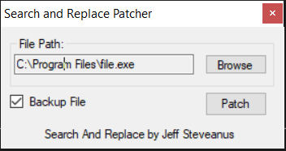

# SnR Patcher

SnR Patcher is a simple Windows Forms utility for searching and replacing hexadecimal patterns in binary files. It allows you to specify multiple search and replace patterns, and can optionally create a backup of the original file before patching.

## Features

- Search and replace multiple hex patterns in files
- Supports wildcards (`??`) in patterns
- Option to create a backup before patching
- Simple and intuitive GUI

## Usage

1. Launch the application.
2. Click **Browse** to select the file you want to patch.
3. (Optional) Ensure **Backup File** is checked to create a `.BAK` backup.
4. Click **Patch** to apply the hex replacements.

## Example Patterns

- **Search:** `41 4E 44 52 4F 49 44 21`
- **Replace:** `42 49 4E 52 ?? ?? ?? 3F`

Wildcards (`??`) can be used to match or ignore specific bytes.

## Building

Open the solution file SnR Patcher.sln in Visual Studio and build the project.

## Code Structure

- `Form1.vb`: Main form and UI logic
- `snr_module.vb`: Hex search and replace logic

## License

This project is provided as-is for educational purposes.
